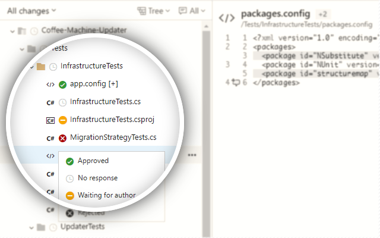

# TFS File Review Status

Track your pull request/commit review progress on a granular, per-file basis.

---



---

## Functionality

- Ability to mark each file as `Approved`, `Waiting` or `Rejected`
- Works for TFS Cloud and TFS on-premises

## Setup

```bash
npm install
```

### Build

```bash
npm run build
```

### Pack before publish

1. Generate `key.pem` once using `npm run keygen` command
1. Execute `gulp pack` command

- You can use `*.crx` file like a custom build. Just drag&drop on `chrome://extensions` page.
- Zip archive is used to upload new version to Chrome Store.

## Credits

Icons made by [Freepik](http://www.freepik.com/) from [Flaticon](http://www.flaticon.com) is licensed by [CC 3.0 BY](http://creativecommons.org/licenses/by/3.0/)